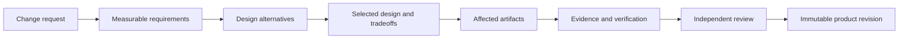
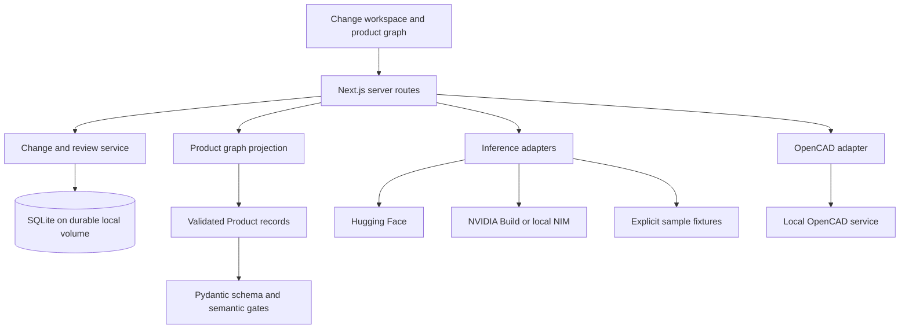

# Caid Labs

**A shared engineering workspace for building physical products.**

Most hardware teams do not struggle with design. They struggle with organization, context, and coordination:

- CAD lives in one place.
- Firmware lives in another.
- BOMs live in spreadsheets.
- Requirements and test evidence live in documents.
- Decisions disappear into chat threads and meetings.

Forma Labs brings the engineering change around those artifacts into one reviewable record. It gives a team a clear answer to four questions: **what changed, why it changed, what it affects, and who accepted the remaining risk**.

Think of it as a GitHub-like coordination layer for hardware engineering: structured change requests, measurable requirements, design alternatives, linked evidence, independent reviews, and immutable product revisions.

> Forma does not replace CAD, ECAD, source control, PLM, ERP, or test systems. The product direction is to connect their authoritative artifacts into a coordinated product history.

## How Forma works

The primary workflow turns an engineering request into a saved design revision:



For example, “increase rover payload to 10.4 kg” is not enough to approve a design. Forma asks for the operating conditions, acceptance method, alternatives considered, affected components, supporting calculations or tests, source revisions, limitations, and the responsible reviewers.

Every saved revision retains:

- the original request and baseline revision;
- measurable requirements and operating conditions;
- alternatives, the selected approach, and accepted tradeoffs;
- artifact values before and after the change;
- evidence type, numeric result, source, method, and limitations;
- individual reviewer decisions and rationale;
- activity history and a SHA-256 snapshot digest.

The digest provides change detection for the exported snapshot. It is not an electronic signature or third-party attestation.

## What works today

### Persistent engineering changes

`/changes` provides a durable request-to-revision workflow on a single persistent Node host:

- local accounts with salted password hashes and hashed eight-hour sessions;
- separate change authors and assigned independent reviewers;
- draft, in-review, changes-requested, and saved states;
- stale-write and stale-baseline protection;
- requirement-linked calculation, simulation, physical-test, and reference evidence;
- numeric target and margin comparisons;
- automatic invalidation of reviews after an edit;
- automatic invalidation of evidence after a requirement, alternative, or selection changes;
- atomic revision creation with immutable application-level snapshots;
- accumulated artifact manifests and JSON revision export.

A change cannot be submitted until it has measurable requirements, at least two alternatives, a selected design with artifact changes, passing non-reference evidence, and an independent reviewer. A revision cannot be saved until every assigned reviewer approves the unchanged proposal.

### Product graph and guided demonstration

`/graph` contains the rover-alpha product graph and guided workflow. It demonstrates dependencies across mechanical, electrical, firmware, BOM, manufacturing, supplier, test, agent, and document artifacts.

The included rover data and walkthroughs are synthetic engineering fixtures. Sample results are labeled as samples and must not be treated as physical validation or manufacturing certification.

### Guarded inference

Forma supports server-selected `mock`, `huggingface`, `nvidia-build`, and `local` inference providers. Model output is advisory. It cannot change protected artifact IDs, pass the canonical semantic gates, approve a change, or create a product revision.

When live inference is unavailable, the normal request fails visibly and remains available for retry. Deterministic examples run only through explicitly labeled sample actions.

### Product validation and optional geometry realization

The Python product pipeline validates structured Product candidates with Pydantic and semantic gates before the sample engineering state can accept them. OpenCAD is an optional local realization boundary for geometry operations and export; it does not replace product validation or independent engineering verification.

## System architecture



The current implementation has two separate revision boundaries:

1. The persistent change workspace records reviewed design decisions and artifact-value changes.
2. The demonstration graph projects validated synthetic Product candidates.

They are not yet synchronized into one production product record. Closing that boundary is a core next step.

## Current limits and next priorities

Forma is an engineering workflow prototype and small-team persistent change system. It is not yet a production system of record for a hardware organization.

| Area | Current state | Priority |
| --- | --- | --- |
| Engineering changes | Persistent, reviewed, revisioned, and exportable on one Node host | Connect revisions to exact CAD, firmware, BOM, requirement, and test versions |
| Product graph | Typed, navigable synthetic rover graph | Add stable artifact identities and incremental synchronization from authoritative tools |
| Impact analysis | Explicit sample relationships and guarded advisory reasoning | Drive impact from confirmed interfaces and dependency rules before agent suggestions |
| Evidence | Structured source, method, conditions, result, margin, and limitations | Ingest signed or checksummed results from real test and simulation systems |
| Agents | Provider abstraction with visible sample/live boundaries | Run agents over revision-scoped real product data and return source-linked claims |
| Access control | Authenticated change API with author/reviewer separation | Add organization tenancy, SSO, MFA, product roles, recovery, and external-collaborator policies |
| Hosting | SQLite on one persistent Node host | Replace SQLite with a managed transactional database for Vercel or multi-instance deployment |
| Integrations | Server adapters for inference and optional OpenCAD | Add production CAD, ECAD, Git, BOM/ERP, PLM, chat, and test connectors |

Authentication currently protects `/api/changes` only. The sample graph and inference endpoints retain their existing access behavior. Do not load confidential engineering data until deployment-wide authorization and the required organizational controls are in place.

## Local development

Requirements:

- Node.js 22.13 or newer
- Python 3 for the Product validation pipeline
- `openssl` or another secure random-token generator for initial workspace setup

Install and start the application:

```bash
npm ci
cp .env.example .env.local
npm run dev
```

The product graph works without provider credentials in explicitly labeled deterministic sample mode.

To initialize the persistent change workspace, add a random setup secret to `.env.local` before starting the server:

```dotenv
FORMA_CHANGE_SETUP_TOKEN=replace-with-at-least-32-random-characters
```

Generate a suitable value with `openssl rand -hex 32`. Then:

1. Open `http://localhost:3000/changes`.
2. Enter the setup token and create the first owner account.
3. Remove `FORMA_CHANGE_SETUP_TOKEN` after the owner exists.
4. Sign in and create an individual account for each reviewer.

Development data defaults to `.forma/changes.sqlite`, which is ignored by Git and survives application restarts.

For a production deployment on one persistent Node host, also configure:

```dotenv
FORMA_CHANGE_DB=/absolute/path/on-a-durable-volume/changes.sqlite
FORMA_CHANGE_ORIGIN=https://your-exact-public-origin.example
```

Serve production traffic through HTTPS. Do not place the SQLite database on a network filesystem or run multiple application instances against separate copies.

See [Persistent engineering change workflow](docs/persistent-change-workflow.md) for the complete storage, security, review, and trust boundaries.

## Optional inference providers

Provider credentials remain server-side. The browser never receives provider URLs or tokens.

For Hugging Face Inference Providers:

```dotenv
FORMA_INFERENCE_PROVIDER=huggingface
HF_TOKEN=your-server-only-token
```

The token needs **Make calls to Inference Providers** permission. NVIDIA Build, local NIM, NemoClaw, and OpenCAD configuration are documented in:

- [Inference architecture](docs/inference-architecture.md)
- [OpenCAD integration](docs/opencad-integration.md)

Never commit `.env.local`, provider tokens, setup secrets, or hosting credentials.

## Verification

Run the frontend, domain, workflow, and Product validation checks:

```bash
npm run lint
node --test tests/change-workflow.test.cjs tests/revision-approval.test.cjs
npm run build -- --webpack
npx tsc --noEmit
node scripts/verify-change-http.mjs

python3 -m venv .venv
.venv/bin/python -m pip install -r requirements.txt
.venv/bin/python product_pipeline/validate.py \
  --no-quarantine product_pipeline/dataset/products/*.json
```

The production build generates Next.js route types used by the standalone TypeScript check. Run the commands in this order on a fresh checkout. The current `next/font` configuration also downloads Geist during the build, so the first build requires access to `fonts.googleapis.com`. `verify-change-http.mjs` then starts an isolated local server with disposable storage.

## Repository map

```text
app/changes/             Persistent change, evidence, review, and revision UI
app/graph-workspace.tsx  Product graph and guided engineering demonstration
app/api/changes/         Authenticated change-workflow API
lib/changes/             Change domain model and transactional SQLite store
lib/                     Product, agent, inference, scanner, and OpenCAD adapters
product_pipeline/        Canonical Product schema, generation, and validation
synthetic-assets/        Explicitly synthetic rover fixtures and evidence
tests/                   Change and revision behavior tests
docs/                    Architecture, hosting, inference, OpenCAD, and test guidance
```

## Vercel deployment

The current Vercel configuration hosts the product graph and can use Hugging Face when `HF_TOKEN` is configured. It does **not** host the persistent change workflow because serverless function-local storage is not durable shared storage. `/changes` returns an unavailable response there by design, and the hosted homepage remains the graph experience.

Before enabling persistent changes on Vercel, replace the SQLite adapter with a managed transactional database while preserving server authorization, version checks, evidence invalidation, immutable revision snapshots, and atomic product-head updates.

## Product principle

CAD tools create geometry. Git stores code. ERP manages purchasing. Chat enables conversation. Forma Labs turns their fragmented output into coordinated engineering decisions and a trustworthy product history.

Better hardware starts with better engineering software.
